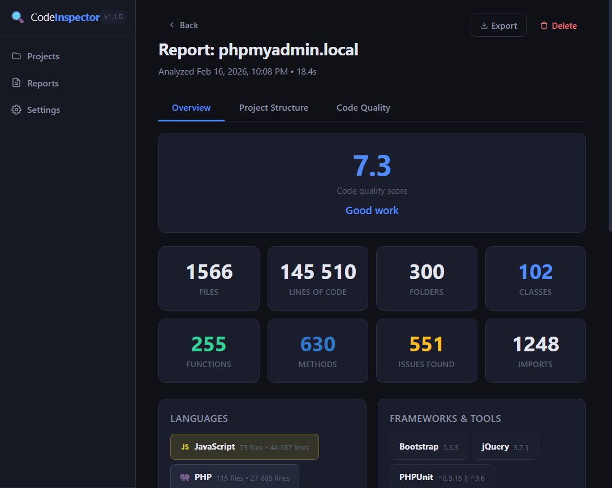
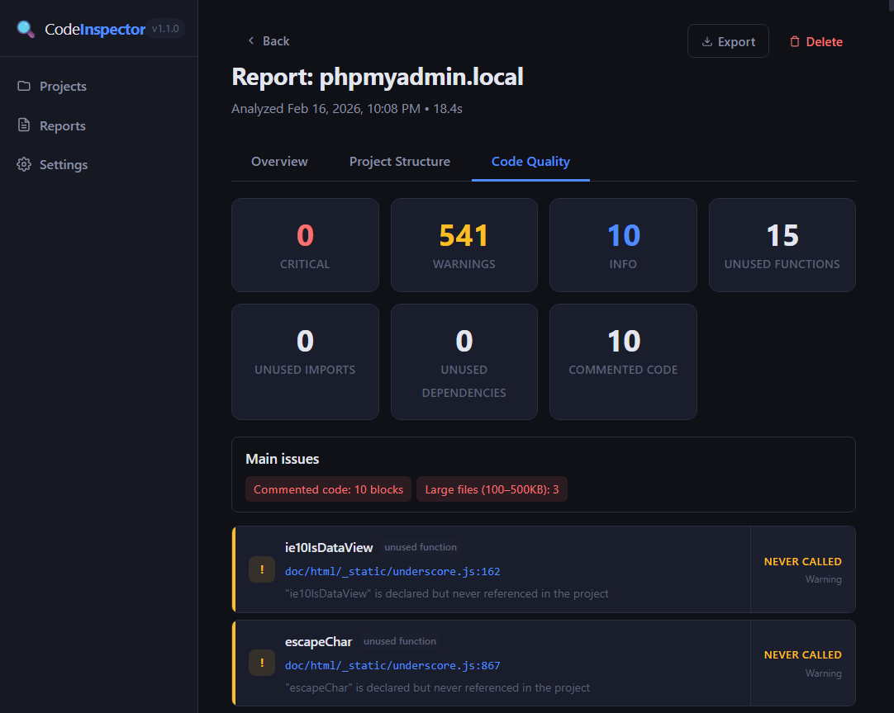
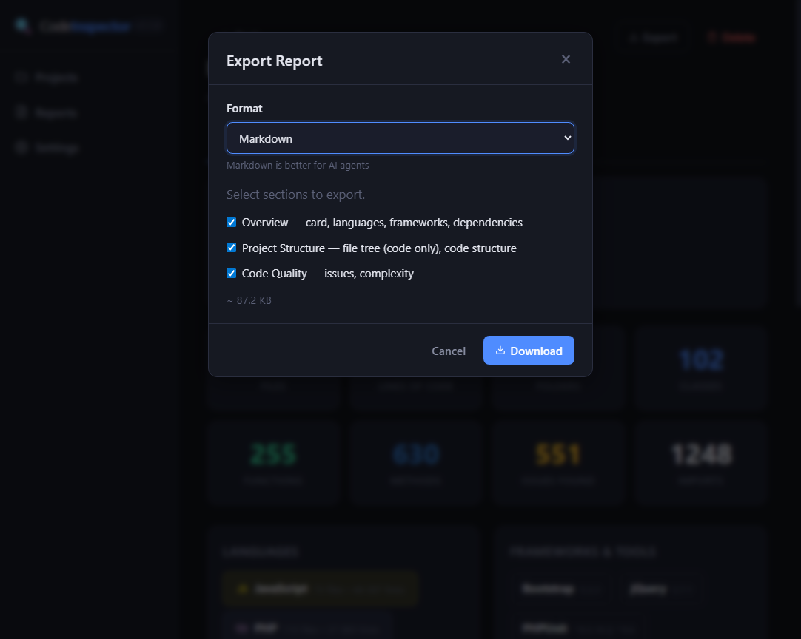

# CodeInspector

**Local code analyzer for web projects — generates structured reports for developers and AI agents.**
https://github.com/geniden/codeinspector

CodeInspector scans your project's source code (PHP, JavaScript, TypeScript, Vue) and produces a detailed, structured report: file tree, code structure, technology stack, code quality issues, and more. Reports are saved as JSON files and displayed in a modern web dashboard.

Designed as a **local tool** for developers — runs on your machine, no cloud, no data leaves your computer.

**Built on the [LAYERS pattern](https://github.com/geniden/layers-pattern)** — each analysis step is an isolated, testable layer with its own contract.

### Screenshots

| Overview — code quality score, stats, languages | Code Quality — issues, main deductions | Export Report — JSON / Markdown |
|:---:|:---:|:---:|
|  |  |  |

---

## What It Does

```
┌──────────────────────────────────────────────────────────┐
│                   CodeInspector Pipeline                  │
├──────────────────────────────────────────────────────────┤
│                                                           │
│  Project Root Directory                                   │
│         ↓                                                 │
│  ┌─────────────────────────────────────────────────────┐  │
│  │  Layer 1: File System                               │  │
│  │  • Scan directories, collect file metadata          │  │
│  │  • Build smart file tree (code files + asset count) │  │
│  │  • Skip minified files (.min.js, .min.css)          │  │
│  └─────────────────────────────────────────────────────┘  │
│         ↓ snapshot                                        │
│  ┌─────────────────────────────────────────────────────┐  │
│  │  Layer 2: Tech Stack Detection                      │  │
│  │  • Detect languages, frameworks, versions           │  │
│  │  • Parse package.json, composer.json, tsconfig.json │  │
│  │  • List dependencies (production + dev)             │  │
│  └─────────────────────────────────────────────────────┘  │
│         ↓ snapshot                                        │
│  ┌─────────────────────────────────────────────────────┐  │
│  │  Layer 3: Code Structure                            │  │
│  │  • Extract classes, functions, methods, imports     │  │
│  │  • Detect visibility, static, async, return types   │  │
│  │  • PHP, JS/TS, Vue SFC support                     │  │
│  └─────────────────────────────────────────────────────┘  │
│         ↓ snapshot                                        │
│  ┌─────────────────────────────────────────────────────┐  │
│  │  Layer 4: Code Quality                              │  │
│  │  • Unused functions, methods, classes               │  │
│  │  • Unused imports and dependencies                  │  │
│  │  • Large functions (language-aware thresholds)      │  │
│  │  • Commented-out code blocks (dead code)            │  │
│  │  • Cyclomatic complexity per file                   │  │
│  │  • PHP dynamic class loading detection              │  │
│  └─────────────────────────────────────────────────────┘  │
│         ↓ snapshot                                        │
│  ┌─────────────────────────────────────────────────────┐  │
│  │  Layer 5: Key Locations                             │  │
│  │  • Entry points, DB config, .env, logs               │  │
│  │  • Dotted config files (per project type)            │  │
│  └─────────────────────────────────────────────────────┘  │
│         ↓ snapshot                                        │
│  ┌─────────────────────────────────────────────────────┐  │
│  │  Layer 6: Code Score                                │  │
│  │  • 0–10 quality score with feedback message          │  │
│  │  • Penalties: commented code, large files, unsafe SQL│  │
│  │  • Bonuses: PHP types, ES6+ usage                    │  │
│  └─────────────────────────────────────────────────────┘  │
│         ↓                                                 │
│  JSON Report → saved to disk + displayed in dashboard     │
│                                                           │
└──────────────────────────────────────────────────────────┘
```

## Features

- **File System Analysis** — smart file tree that shows code files individually and collapses assets (images, fonts, media) into a summary line
- **Technology Stack Detection** — identifies languages, frameworks, PHP/ECMAScript/TypeScript versions, package managers, config files
- **Code Structure Extraction** — classes, functions, methods with visibility, parameters, return types, inheritance
- **Code Quality Checks** — unused symbols, unused imports, unused dependencies, commented-out code blocks, cyclomatic complexity (PHP/JS/TS only for size penalties)
- **Code Quality Score (0–10)** — overall score with penalties (commented code, large code files >100KB, unsafe SQL) and bonuses (PHP types, ES6+ usage). **Main issues** block lists what caused deductions.
- **Key Locations** — entry points, DB config, .env files, logs, dotted config — detected per project type (PHP, Node.js, SPA, Telegram bot)
- **PHP Dynamic Loading Awareness** — detects `new $variable` patterns and marks potentially dynamic classes as informational instead of false positives
- **Dependency Audit** — lists all npm/composer dependencies and checks if they are actually imported in the code
- **Report Export** — export reports as **JSON** or **Markdown** with selectable sections (Overview, Project Structure, Code Quality). Markdown is optimized for AI agents.
- **Report History** — all analysis reports are saved as JSON files, viewable without re-running analysis
- **Code Preview** — click any file path in an issue to open a quick code viewer with syntax highlighting and line scrolling
- **Localization (EN/RU)** — full interface in English or Russian, selectable in Settings
- **Light & Dark Themes** — switch between dark and light color schemes in Settings
- **Auto Port Selection** — if port 3031 is busy, automatically finds the next available port

## Supported Languages

| Language     | Structure | Quality | Versions |
|-------------|-----------|---------|----------|
| **PHP**     | Classes, functions, methods, properties | Unused code, dead code, complexity | Detected from composer.json + code patterns |
| **JavaScript** | Classes, functions, arrow functions, imports/exports | Unused code, dead code, complexity | ECMAScript version detected from code |
| **TypeScript** | Full JS support + type annotations | Same as JS | Detected from tsconfig.json |
| **Vue SFC** | Script section analysis (Options API + `<script setup>`) | Same as JS | — |
| **JSON** | package.json, composer.json, tsconfig.json parsing | Dependency audit | — |

## Current Limitations

- **Does not support WordPress** and similar CMS frameworks where code or templates may be stored in a database
- **Does not support frameworks with code generation** (e.g., scaffolded code that only exists after build)
- **Static analysis only** — does not execute code, does not resolve runtime dependencies
- **No AST parsing** — uses regex-based analysis (fast but may miss edge cases)

## Best Suited For

- **Microservices** on PHP or Node.js
- **Custom web applications** and frameworks
- **Self-written projects** without heavy framework magic
- **Code review preparation** — get a quick overview before diving into the code
- **AI agent context** — generate a compact JSON report as input for LLM-based code review

## Web Dashboard

CodeInspector includes a modern, responsive web dashboard with:

- **Projects page** — add, configure, and manage multiple projects. Project types: Auto, PHP, Telegram bot PHP, Node.js, SPA, PWA, Telegram Mini App, Static
- **Report viewer** with 3 tabs:
  - **Overview** — code quality score (0–10), stats, Key Locations, language badges, frameworks, dependencies
  - **Project Structure** — smart tree view with folder stats, collapsible file-by-file view of classes/functions/methods, code preview links
  - **Code Quality** — Main issues (score deductions), sorted issues with severity, clickable file paths, code preview, complexity analysis table (files with complexity > 10)
- **Export** — download report as JSON or Markdown; choose sections to include
- **Settings** — theme (dark/light), **language (EN/RU)**, default excluded folders, LLM configuration
- **SQLite storage** — projects and analysis metadata persisted locally

## Quick Start (Windows 11)

### Option 1: Double-click launcher

```
start.bat
```

The launcher will:
1. Check that Node.js is installed
2. Install dependencies if `node_modules` is missing
3. Open the browser at `http://localhost:3031`
4. Start the server (keep the window open)

### Option 2: Manual start

```bash
# Clone the repository
git clone https://github.com/geniden/codeinspector.git
cd codeinspector

# Install dependencies
npm install

# Start the server
npm start

# Open in browser
# http://localhost:3031
```

### Requirements

- **Node.js** v18+ (tested on v22)
- **Windows 11** (primary platform, should work on macOS/Linux too)
- No other dependencies — SQLite is bundled via `better-sqlite3`

## Project Structure

```
codeinspector/
├── server/                              # Express.js backend
│   ├── server.js                        #   HTTP server with auto port selection
│   ├── database/
│   │   └── db.js                        #   SQLite connection + schema
│   └── routes/
│       ├── projects.js                  #   Project CRUD API
│       ├── analysis.js                  #   Analysis trigger + status polling
│       └── reports.js                   #   Report viewer + file preview API
│
├── layers/                              # Analysis layers (LAYERS pattern)
│   ├── core/
│   │   ├── base-layer.js               #   Abstract base class for all layers
│   │   ├── analysis-engine.js          #   Orchestrator: snapshot → deltas → commit
│   │   └── LAYER.md                    #   Core engine contract
│   ├── 01-file-system/
│   │   ├── file-system-layer.js        #   Directory scanning, file tree, metadata
│   │   └── LAYER.md                    #   Layer contract
│   ├── 02-tech-stack/
│   │   ├── tech-stack-layer.js         #   Language/framework/version detection
│   │   └── LAYER.md                    #   Layer contract
│   ├── 03-code-structure/
│   │   ├── code-structure-layer.js     #   Classes, functions, methods extraction
│   │   └── LAYER.md                    #   Layer contract
│   └── 04-code-quality/
│       ├── code-quality-layer.js       #   Unused code, dead code, complexity
│       └── LAYER.md                    #   Layer contract
│  ├── 05-key-locations/
│  │   └── key-locations-layer.js       #   Entry points, DB config, .env, logs
│  └── 06-code-score/
│       └── code-score-layer.js         #   Quality score 0–10, deductions
│
├── frontend/                            # Single-page web dashboard
│   ├── index.html                      #   SPA layout
│   ├── css/style.css                   #   Dark + light themes
│   ├── js/app.js                       #   Frontend logic
│   └── lang/
│       ├── en.json                     #   English strings
│       └── ru.json                     #   Russian strings
│
├── reports/                             # Generated JSON reports (gitignored)
├── data/                                # SQLite database (auto-created)
├── start.bat                            # Windows launcher
├── package.json
├── LICENSE
└── README.md
```

## LAYERS Pattern

Each analysis step is implemented as an isolated **layer** following the [LAYERS pattern](https://github.com/geniden/layers-pattern):

1. **Immutable snapshots** — each layer receives a frozen copy of the accumulated state
2. **Delta-based writes** — layers return only what changed, never mutate state directly
3. **Atomic commits** — all deltas are merged into the state at once
4. **Layer isolation** — each layer has its own `LAYER.md` contract and can be modified independently
5. **Deterministic** — same input always produces the same output

This makes each layer independently testable and easy for AI agents to understand and modify.

## API Endpoints

| Method | Endpoint | Description |
|--------|----------|-------------|
| GET | `/api/projects` | List all projects |
| GET | `/api/projects/:id` | Get project details |
| POST | `/api/projects` | Create a new project |
| PUT | `/api/projects/:id` | Update project settings |
| DELETE | `/api/projects/:id` | Delete project and reports |
| POST | `/api/analysis/start` | Start analysis for a project |
| GET | `/api/analysis/:id/status` | Poll analysis progress |
| GET | `/api/reports/project/:id` | List reports for a project |
| GET | `/api/reports/:id` | Get full report data |
| GET | `/api/reports/file-preview/:projectId?path=...` | Read source file for code preview |
| DELETE | `/api/reports/:id` | Delete a report |
| GET | `/api/health` | Server health check |

## Roadmap

- [ ] WordPress layer — understand hooks, template hierarchy, `functions.php`
- [ ] Laravel/Symfony layer — route analysis, service container, middleware
- [ ] React/Vue component analysis — props, state, lifecycle
- [ ] AST-based parsing (replacing regex) for higher accuracy
- [ ] LLM integration (Ollama) — semantic code review with local models
- [x] Multi-language interface (EN/RU)
- [x] Export reports (JSON, Markdown)

---

## Author

Created by **Anton Emelyanov** — concept, architecture, and implementation.

- GitHub: [@geniden](https://github.com/geniden)
- Email: geniden@gmail.com

## License

MIT — Copyright (c) 2026 Anton Emelyanov
